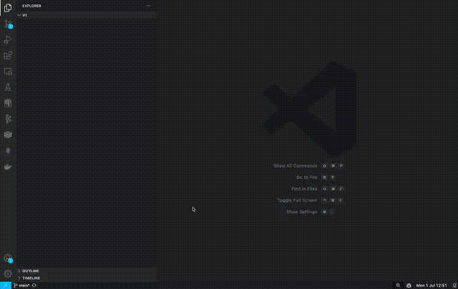
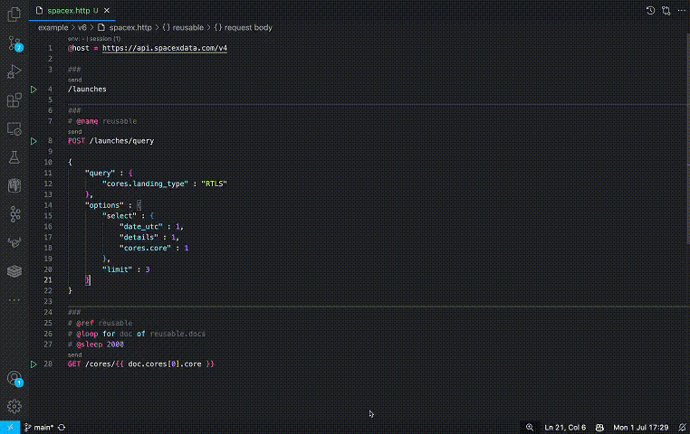

# Best Postman Alternative

No, it's not Insomnia. In fact, this instrument is not even an app, it's just a VS Code extension. The extension is called HttpYac, and it is a file-based tool. So you can just create a `.http` file, send a request, and maybe even commit the file without ever leaving VS Code. The tool is powerful and fun to use, but learning it can be quite a twisted journey. So, let me guide you through!

> I feel the tool gives the most for coders. If you just starting your IT journey the tool may be an overkill. But feel free to come back once you are tired of standard, inefficient apps.


## Getting Started

I'll assume you have [VS Code](https://code.visualstudio.com/) installed. Now, let's go straight to requests. We'll use the [SpaceX API](https://github.com/r-spacex/SpaceX-API) for our experiments. Here's what will need to do, to get started:

1. Install the [HttpYac Extension](https://marketplace.visualstudio.com/items?itemName=anweber.vscode-httpyac)
2. Create a file `spacex.http`
3. Put a single line with the api url `https://api.spacexdata.com/v4/launch`
4. Click on the send button, which appears above the url.



Okay, that gave us a lot of information, regarding the SpaceX launches. Perhaps, the thing SpaceX is most famous for is its ability to land and reuse rockets. In the API they call such landing RTLS (Return To Launch Site). Let's get us the 3 oldest launches with the landing type. Will limit our selection to `details`, `date_utc`, and `core`. Here's what the http file syntax will expect us to do:

- Add an HTTP method name (`POST`) at the start, before a url.
- Put headers as `Header: Value` below the first line
- Put the request body below the headers.

And here's what will get:

```http
POST https://api.spacexdata.com/v4/launches/query
Content-Type: application/json

{
    "query" : {
        "cores.landing_type" : "RTLS"
    },
    "options" : {
        "select" : {
            "date_utc" : 1,
            "details" : 1,
            "cores.core" : 1
        },
        "limit" : 3
    }
}
```

Sending the response gives us a response with 3 docs and just enough understanding of the basics of HttpYac.

## Now the Cool Part

Let's now refactor the code a little. The first thing you may notice is that we duplicated the base url (`https://api.spacexdata.com/v4`). Fortunately, HttpYac does provide support for variables. We can use `@x = ...` to declare a variable and `{{ x }}` to put the variable in a line. So, here's how we can refactor our code:

```http
@baseUrl = https://api.spacexdata.com/v4

{{ baseUrl }}/launches

POST {{ baseUrl }}/launches/query
Content-Type: application/json

{
    "query" : {
        "cores.landing_type" : "RTLS"
    },
    "options" : {
        "select" : {
            "date_utc" : 1,
            "details" : 1,
            "cores.core" : 1
        },
        "limit" : 3
    }
}
```

Moreover, HttpYac does have one special variable, called `host`, that covers exactly this case and is prefixed for urls starting with `/` automatically. So we'll get an even tidier code:

> HttpYac separated `regions` by 3 hashes `###`. A code above the first section separator `###` is considered global. In my experience, HttpYac works the most stable when each request is in its separate region. So we'll also add the hashes.

```http
@host = https://api.spacexdata.com/v4

###
/launches

###
POST /launches/query
Content-Type: application/json

{
    "query" : {
        "cores.landing_type" : "RTLS"
    },
    "options" : {
        "select" : {
            "date_utc" : 1,
            "details" : 1,
            "cores.core" : 1
        },
        "limit" : 3
    }
}
```

The next tedious part is the `Content-Type` header. You may imagine, that this header will be needed for almost all the APIs out there. Again, in this case, that's pretty easy to avoid duplication. We'll use VS Code settings for that:

- In Command Palette `Cmd + Shift+ P` send command `Preferences: Open User Settings (JSON)`.
- In the root document insert the block:

```json
    "httpyac.requestDefaultHeaders": {
        "Content-Type" : "application/json"
    },
```

Here's how our file looks now:

```http
@host = https://api.spacexdata.com/v4

###
/launches

###
POST /launches/query

{
    "query" : {
        "cores.landing_type" : "RTLS"
    },
    "options" : {
        "select" : {
            "date_utc" : 1,
            "details" : 1,
            "cores.core" : 1
        },
        "limit" : 3
    }
}
```

## And Even Cooler

Perhaps, the most common thing one needs to do when using an API is to reuse values from one request in another. Gladly, HttpYac has pretty easy support for it. Remember the launch information we get?

```json
{
  "docs": [
    {
      "details": "Total payload mass was 2,034 kg (4,484 lb) : 11 satellites weighing 172 kg each, plus a 142-kg mass simulator. This was the first launch of the upgraded v1.1 variant (later called Falcon 9 Full Thrust), with a 30 percent power increase. Orbcomm had originally agreed to be the third flight of the enhanced-thrust rocket, but the change to the maiden flight position was announced in October 2015. SpaceX received a permit from the FAA to land the booster on solid ground at Cape Canaveral, and succeeded.",
      "date_utc": "2015-12-22T01:29:00.000Z",
      "cores": [
        {
          "core": "5e9e28a1f3591867753b263b"
        }
      ],
      "id": "5eb87cefffd86e000604b342"
    },
    {
      "details": "Among other cargo, an International Docking Adapter (IDA-2) was carried to the ISS. This mission had a successful first-stage landing at Cape Canaveral.*Including the reusable Dragon Capsule, total payload to orbit was 6457 kg.",
      "date_utc": "2016-07-18T04:45:00.000Z",
      "cores": [
        {
          "core": "5e9e28a2f359187f273b2642"
        }
      ],
      "id": "5eb87cf9ffd86e000604b349"
    },
    {
      "details": "First Falcon 9 flight from the historic LC-39A launchpad at Kennedy Space Center, carrying supplies and materials to support dozens of science and research investigations scheduled during ISS Expeditions 50 and 51. The first stage returned to launch site and landed at LZ-1.",
      "date_utc": "2017-02-19T14:39:00.000Z",
      "cores": [
        {
          "core": "5e9e28a3f3591829dc3b2646"
        }
      ],
      "id": "5eb87cfeffd86e000604b34d"
    }
  ],
  "totalDocs": 27,
  "offset": 0,
  "limit": 3,
  "totalPages": 9,
  "page": 1,
  "pagingCounter": 1,
  "hasPrevPage": false,
  "hasNextPage": true,
  "prevPage": null,
  "nextPage": 2
}
```

Let's find out what happened to the core from the first launch. We'll need to grab the core ID and send a new request. Here's how we'll do it

- Name the launch request using `# @name reusable`. We'll call that request `reusable`.
- Reference the request in the next one `# @ref reusable`
- Access value of field `core` of first `[0]` element in `cores` array from the first `[0]` element in the `docs` property of the request-response: `{{ reusable.docs[0].cores[0].core }}`

Here's what our requests file will look like after the changes:

```http
@host = https://api.spacexdata.com/v4

###
/launches

###
# @name reusable
POST /launches/query

{
    "query" : {
        "cores.landing_type" : "RTLS"
    },
    "options" : {
        "select" : {
            "date_utc" : 1,
            "details" : 1,
            "cores.core" : 1
        },
        "limit" : 3
    }
}

###
# @ref reusable
GET /cores/{{ reusable.docs[0].cores[0].core }}
```

This is what we'll get about the core after clicking the `send` button:

```json
{
  "block": 1,
  "reuse_count": 0,
  "rtls_attempts": 1,
  "rtls_landings": 1,
  "asds_attempts": 0,
  "asds_landings": 0,
  "last_update": "Retired; permanently displayed at Hawthorne headquarters. ",
  "launches": [
    "5eb87cefffd86e000604b342"
  ],
  "serial": "B1019",
  "status": "inactive",
  "id": "5e9e28a1f3591867753b263b"
}
```

Hmm, retired, this is boring. Let's check out another one. We can do something just a little bit nicer. The syntax we used for naming and referencing requests (`# @foo bar`) is used to create metadata in HttpYac. And there are quite a few built-in metadata handlers, including the one, called `@loop` and the one called `sleep`. So we'll:

- Loop `docs` returned in `reusable` request: `# @loop for doc of reusable.docs`
- Freeze between the request for 2 seconds: `# @sleep 2000`



## CLI

| Output    | Gives You                        |
|-----------|----------------------------------|
| short     | Method, Url -> Status, Elapsed   |
| body      | Just Response Body               |
| headers   | Request and Response Headers     |
| response  | Response Headers and Body        |
| exchange  | All Headers and Body             |
| none      | Just how many requests processed |

## Wrapping Up

Although we've seen a lot of cool things HttpYac can do, the article didn't cover a bunch of other features. For example, httpyac supports:

- GraphQL
- GRPC
- RabbitMQ (yes, even this!)
- Assertions
- Node JS Scripting

And there's probably something else, so I encourage you to check out the [project page](https://httpyac.github.io/) to find out what else you can achieve. And, by the way ...claps for the article are also appreciated 👉👈
